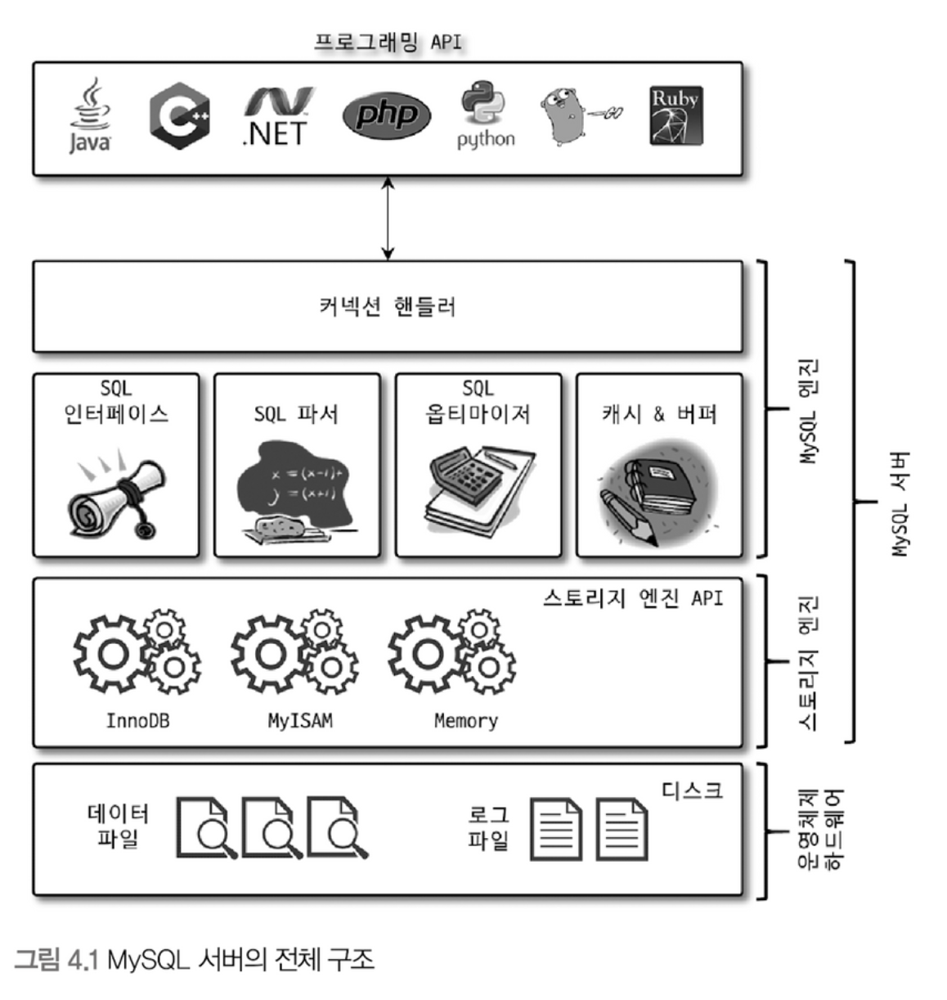

## MySQL 기본 구조

MySQL은 크게 `MySQL 엔진`과 `스토리지 엔진`으로 나뉜다.

`MySQL 엔진`은 주로 커넥션 핸들러, SQL 파서, 전 처리기, 쿼리 옵티마이저로 구성되어 있다.

MySQL은 표준 SQL(ANSI SQL) 문법을 따르기 때문에 타 DBMS와 호환되어 실행될 수 있다.

`Storage 엔진`은 디스크로 부터 데이터를 읽어오거나 디스크에 데이터를 쓰는 행위를 전담한다.

`MySQL 엔진은` 단 하나이지만, `Storage 엔진`은 여러 개를 동시에 사용할 수 있다.

예를들어 테이블에 다음과 같이 적용하면, 해당 테이블에 읽기/쓰기작업 처리시 해당 엔진을 사용하게 된다.

```sql
CREATE TABLE test_table (fd1 INT, fd2 INT) ENGINE=INNODB;
```
이러한 스토리지 엔진에는 크게 `InnoDB`와 `MyISAM`으로 나눠져 있다.

마지막으로 `핸들러 API`라는 개념이 있다.

이는 `MySQL엔진`과 `MySQL 스토리지 엔진`사이에서 서로의 필요한 요청을 요청하는 API를 말한다

즉, `MySQL엔진`에서 DISK I/O가 필요하여 `MySQL 스토리지 엔진`에게 요청하는것도 `핸들러 API`이고, `DISK I/O`를 끝마치고 얻은 데이터를 `MySQL 엔진`에게 넘겨주는것도 `핸들러 API`를 사용하는것

<figure>

<figcaption>출처: <a href="https://velog.io/@klm03025/Real-MySQL-%EC%A0%95%EB%A6%AC-4%EC%9E%A5-%EC%95%84%ED%82%A4%ED%85%8D%EC%B3%90">velog</a></figcaption>
</figure>

### MySQL 스레딩 구조

MySQL 서버는 스레드 기반으로 동작하며, 크게 `포그라운드 스레드`와 `백그라운드 스레드`로 나뉜다.

`포그라운드 스레드(클라이언트 스레드)`는 주로 커넥션 연결 및 사용자 요청처리를 담당

작업이 끝나고나면 스레드는 스레드 캐시로 되돌아가는데, 항상 되돌아가는것이 아니고 캐시 사이즈에 따라 종료시킬 수 있다.

캐시사이즈는 시스템 변수 `thread_cache_size` <a href="https://dev.mysql.com/doc/refman/8.4/en/server-system-variables.html#sysvar_thread_cache_size">시스템 변수</a>로 처리한다.

- 읽기 요청: 버퍼 풀과 캐쉬에 먼저 데이터가 있는지 확인하고, 없으면 `직접` 관련 스토리지 엔진을 통해 DISK I/O를 진행한다.

- 쓰기 요청: 곧바로 DISK I/O를 진행하지 않고, 버퍼 풀 사이즈에 변경사항을 쓴다.

`백그라운드 스레드`는 다음과 같이 다양한 작업을 처리한다.

- 인서트 버퍼를 병합하는 스레드

- **로그를 디스크로 기록하는 스레드**

- **InnoDB 버퍼 풀의 데이터를 디스크에 기록하는 스레드**

- 데이터를 버퍼로 읽어오는 스레드

- 잠금이나 데드락을 모니터링하는 스레드

저 들 모두가 중요하지만, 그중에서도 `로그 기록`과 `버퍼풀에 쌓인것을 기록`하는 `쓰기 스레드`를 수행하는 백그라운드 스레드가 중요하다.

왜냐하면 읽기 작업의 경우 대부분 클라이언트 스레드에서 수행되기 때문이다.

그래서 `innodb_read_io_threads`로 `innodb`에 대한 읽기 스레드 수를 크게 조정할 필요가 없지만

쓰기작업은 `스토리지 엔진`에 의해 많이 수행되기 때문에, `innodb_write_io_threads`는 적절히 정하는것이 좋다.

### 메모리 할당 및 사용구조

MySQL의 메모리구조는 크게 `글로벌 메모리 영역`과 `로컬 메모리 영역`으로 나뉜다.

`글로벌 메모리 영역`은 클라이언트 스레드수와 무관하게 하나의 메모리 영역만 사용하며 부득이하게 여러개를 사용하더라도 모든 스레드로부터 공유된다.

대표적인 글로벌 메모리 영역은 다음과 같다.

```
테이블 캐시, InnoDB 버퍼 풀, InnoDB 어뎁티브 해시 인덱스, InnoDB 리두 로그 버퍼
```

`로컬 메모리 영역`은 세션 메모리 영역이라고도 부르며, MySQL 서버상에 존재하는 클라이언트 스레드가 쿼리를 처리하는데 사용하는 메모리 영역이다.

MySQL 서버에 접속하게 되면 접속 연결을 유지하는 커넥션이 생성되고 이 커넥션이 결국 클라이언트 스레드가 되며, 이 스레드가 할당받는 메모리영역이 `로컬 메모리 영역`이 된다.

그래서 각 클라이언트 스레드마다 존재하게 되고, 독립적으로 메모리를 할당받는다.

그리고 요청한 쿼리의 용도별로 아에 메모리를 할당하지 않는 경우도 있다.

이게 무슨말이냐면 `해당 쿼리를 처리하는데 필요하지 않을경우엔 할당하지 않는다`는 것

특히 `소트 버퍼`와 `조인 버퍼`가 선택적으로 할당되거나 해제된다.

대표적인 로컬 메모리 영역은 다음과 같다.

```
정렬 버퍼, 조인 버퍼, 바이너리 로그 캐시, 네트워크 버퍼
```


