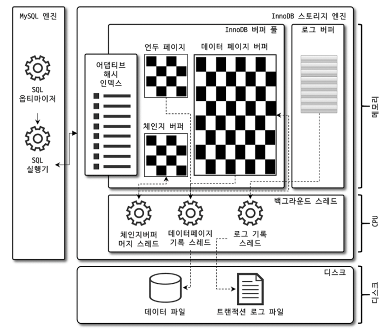

# InnoDB 스토리지 엔진 아키텍처

InnoDB 스토리지 엔진은 거의 유일하게 `레코드 기반의 잠금`을 제공하며 그 때문에 높은 동시성 처리가 가능하고 안정적이며 성능이 뛰어나다.

구조의 사진은 다음과 같다.

<figure>
    
    <figcaption>출처: Real MySQL 8.0</figcaption>
</figure>

## 프라이머리 키에 의한 클러스터링

InnoDB의 모든 테이블은 기본적으로 PK를 기준으로 클러스터링 되어 저장된다.

즉, PK값의 순서대로 디스크에 저장된다는 뜻이며, 모든 세컨더리 인덱스는 레코드의 주소 대신 PK 값을 논리적인 주소로 사용한다.

세컨더리 인덱스가 레코드의 주소대신 PK 값을 논리적인 주소로 사용한다는 것은 <a href="https://dev.mysql.com/doc/refman/8.4/en/innodb-index-types.html">세컨더리 인덱스로 지정된 컬럼의 레코드에는 사실 PK값이 들어가있는 형태라는 것이다.</a>

```sql
CREATE TABLE example (
    id INT PRIMARY KEY,
    name VARCHAR(50),
    age INT,
    INDEX (name)  -- 보조 인덱스 (세컨더리 인덱스)
);

일 때 

SELECT * FROM example WHERE name = 'Alice';

를 발생시키면 결국 'Alice'레코드가 있는 name에 대한 보조인덱스를 따라서 PK 값을 찾고, 해당 PK를 통해 조회하게 된다.
```

## 외래키 지원

InnoDB의 스토리지엔진 레벨에서 지원하는 기능으로 서비스용 DB에서는 사용하지 않을수도 있다.

왜냐하면 외래 키의 생성은 부모 테이블과 자식 테이블 모두 해당 컬럼에 대한 인덱스 생성이 필요하고, 

변경시에는 변경에 영향받는 레코드가 연관있는 테이블내에 존재하는지 검사해야 하기에 잠금이 발생하므로 데드락 위험에 놓인다.

한번씩 수동으로 외래키 관계에 놓은 테이블에 데이터를 적재하거나 변경하는 등의 작업에 있어서 제약이 걸리는 경우가 많은데,

급한경우 `foreign_key_checks` 시스템 변수를 OFF로 설정하면 체크작업을 멈출 수 있다.

물론 일시적으로 해제한체로 작업하고, 다시 ON할때에는 해당 외래키의 조건을 연관있는 레코드들이 맞춰져있어야 한다.