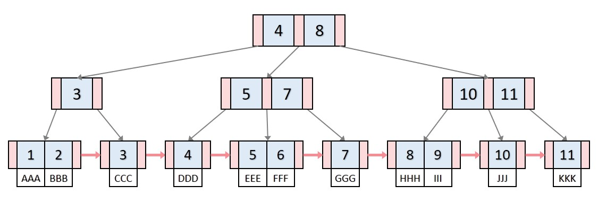

### 순차 I/O 와 랜덤 I/O

순차 I/O는 특정 시작점에서 부터 순차적으로 읽어 들이기 때문에 디스크 헤드가 움직일 일이 많지 않다.

랜덤 I/O는 그에비해 랜덤한 디스크내의 특정 위치로 디스크헤드를 옮겨야 하기 때문에 그만큼의 오버헤드가 계속 쌓이게 된다.

따라서 일반적으로 얘기하는 쿼리 튜닝의 이야기는 랜덤 I/O의 쿼리를 순차 I/O로 개선하는 것이 해당된다.

## 인덱스

인덱스는 흔히 색인이라고 하며, DBMS의 특정 테이블 내 레코드에 빠르게 접근하기 위해 미리 생성해둔 것이라 볼 수 있다.

인덱스를 활용한다는 것은 빠르게 원하는 정보에 접근하기 위함을 의미하고, 그러기 위해서는 "정렬"인 상태를 기본 전제하에 둔다.

정렬 구조를 유지하는 이상 조회는 굉장히 빠르지만, 변경, 삭제, 삽입의 행위는 상대적으로 포기하게 된다.

그렇다고 `where`절에 오는 모든 컬럼을 인덱스로 분류할 것인가? 그건 또아니다. 왜냐하면 인덱스로 분류하는 만큼 변경, 삭제, 삽입에 시간이 소요되기 때문이다.

인덱스를 만들기 위해 주로 사용되는 자료구조로 Hash 인덱스와 B트리 인덱스가 있다.

Hash 인덱스는 인덱스로 지정한 값을 변경하여 사용하기 때문에 B트리 인덱스의 prefix search 등의 지원은 안되지만 상당히 빠른 해싱 검색을 지원한다.

B트리는 Balanced-tree 로서 주로 DBMS 에서 많이 사용되는 자료구조이다.

B트리는 정확하게는 B+ 트리를 대부분 사용하며, B* 트리도 사용한다.

### B+ 트리 인덱스

B+ 트리의 기본적인 구조는 루트 노드, 브랜치 노드, 리프 노드가 있다.

리프노드에는 인덱스키와 실제 레코드로 이어지는 주소가 존재한다. 그리고 리프노드사이에는 형제노드를 연결리스트 형태로 이동이 가능하다.

일반적으로 다음과 같이 생겼다.



B+ 트리의 리프노드를 따라 들어가더라도, 일반적인 DBMS는 인덱스와 마찬가지로 실제 레코드가 정렬되어 있진 않다.

하지만 MySQL의 InnoDB 엔진은 기본적으로 클러스터 인덱스를 지원하기 때문에 실제 물리적인 데이터 또한 프라이머리키를 기준으로 정렬되어 있다.

또한 InnoDB 엔진에서 중요한점은 세컨더리 인덱스에서 ISAM 엔진과 차이가 있는데,

이는 InnoDB 엔진에서 세컨더리 인덱스를 따라가보면 프라이머리키로 이어져 있기 때문이다.

따라서 InnoDB 엔진에서 인덱스를 통한 검색이 매우 느릴거라고 생각할 수 있지만 큰 문제는 없다.

### B+ 트리의 삽입

B+ 트리에서의 인덱스 추가의 경우 추가할 위치를 미리 선정하고, 해당위치에 추가한 후 

해당 노드의 크기가 너무 클 경우 split이 발생하여 브랜치 노드가 생길 수 있다.

중요한 점은 해당 테이블 내에 인덱스 수에 대한 레코드 1개 추가에 드는 비용이다.

보통 1.5배라고 생각하면 된다.

### B+ 트리의 인덱스 삭제 및 변경

B+ 트리의 인덱스 삭제의 경우에는 곧바로 삭제하지 않고 마킹 해 두고 지연 삭제를 일으키도록 만들었다.

마킹된 인덱스 노드는 재사용가능한 인덱스 노드로도 사용된다.

변경의 경우에는 실제로 B+ 트리 구조상 리프노드의 값을 변경시킬 수 없기 때문에

해당 노드를 삭제하고 새로운 변경값이 들어간 노드를 삽입하는 과정으로 처리한다.

이 역시 지연처리가 가능하다.

### B+ 트리 인덱스 검색

트리 탐색으로 검색이 진행되며 prefix 탐색 또한 가능하지만, 뒷부분이 일치하는지에 관한 검색은 할 수없다.

또한 인덱스는 조심해야 할 것이, update나 락을 획득하는 조회를 실행하게 되면 innodb 엔진의 레코드 락이나 넥스트 키 락, 갭락이 걸릴 수 있다.

이는 레코드의 인덱스에 걸리는 것이기 때문에 자칫하면 테이블 전체 레코드에 잠김이 발생할 수 있다.

### 인덱스 키 값의 크기

DBMS에서 모든 데이터의 크기 단위를 블록 혹은 페이지라고 부른다.

일반적으로 InnoDB 엔진의 블록 혹은 페이지의 단위는 4 ~ 64kb 까지 설정이 가능하며, 기본적으로 16kb로 설정되어 있다.

그러면 하나의 인덱스 페이지에 몇개의 자식노드를 저장할 수 있을 까?

이는 인덱스를 어떤 타입의 컬럼에 설정하냐에도 영향을 줄 수 있다.

만약 페이지 단위가 16kb 이고, 인덱스 키 값이 16byte 이며 자식노드 주소 저장길이가 12byte라면

16 * 1024 / (16 + 12) = 585개의 자식노드를 가질 수 있다.

만약 여기서 인덱스키의 크기를 2배로 늘린다면 372개의 자식노드를 가질수 있게 된다.

이는 곧 인덱스를 통한 검색에서 레코드를 500개 읽어야 한다면 전자는 하나의 인덱스페이지를 통해 다 읽어들일 수 있지만

후자는 두 번 읽어들여야 하기 때문에 그만큼 느려진다.

### 기수성

기수성 혹은 선택성이라고 하는데, 이는 해당 컬럼내에 중복을 제외한 값의 비율을 의미 한다.

예를들어 10000개의 데이터 중 col1을 기준으로 distinct 하면 10개가 나오고, col2를 기준으로 수행하면 1000개가 나온다고 하자.

이러한 상황에서 col1과 col2에 대한 where 절이 있는 select 문을 실행하면 어떻게 될까?

전자의 경우에는 col1에 대한 인덱스를 통해 1개를 가져올 것이고, 그 하나의 인덱스의 모든자식노드 1000개와 col2 조건절을 비교할 것이다.

후자의 경우에는 col2에 대한 인덱스를 통해 1개를 가져올 것이고, 그 하나의 인덱스에 모든자식노드 10개를 읽어들어와 col1과 비교할 것이다.

따라서 유니크 값의 개수가 인덱스 활용에 영향을 미친다.

그러면 MySQL은 인덱스를 활용할지 말지를 어떻게 결정하게 될 것인가?

일반적으로 전체 테이블의 20% ~ 25% 정도의 데이터까지는 인덱스를 통해 읽어들이는 것이 좋고, 그 박의 경우에는 풀테이블 이후 필터링하는것이 좋다.

### B+ 트리를 통해 인덱스 읽기

이러한 B+ 트리의 인덱스를 읽는 방법에는 총 3가지가 있다.

인덱스 레인지 스캔, 인덱스 풀 스캔, 루즈 인덱스 스캔, 인덱스 스킵 스캔이 있다.

- 인덱스 레인지 스캔: 인덱스를 사용한 범위 쿼리에서 사용되며, 인덱스 트리의 리프노드의 시작점부터 끝점까지 지정하고, 그 개수만큼 실제 데이터 영역에 랜덤 I/O가 발생한다.
    - 왜냐하면 세컨더리 인덱스의 경우에는 실제 인덱스의 정렬순과 매핑된 프라이머리키의 정렬순은 다를 수 있기 때문이다.
    - 따라서 20 ~ 25%의 손익 분기점을 넘어선다면 테이블 데이터를 직접 다 읽어오는 방식을 생각해봐야 한다.

- 인덱스 풀 스캔: 인덱스 레인지 스캔과는 달리 인덱스의 처음부터 끝까지 다 읽어들이는 것으로, 효율적인 인덱스 활용은 아니다.
    - 주로 where절과 같은 조건절의 컬럼이 인덱스의 첫번째 컬럼이 아닌경우 발생한다.
    - 물론 풀테이블 스캔보다는 빠를 수 있는데, 이유는 인덱스에 해당하는 컬럼만 조회할 시에는 빠르다는 것이다.

- 루스 인덱스 스캔: GROUP BY에서 주로 활용되며 말뜻 그대로 듬성듬성 읽는 방식을 의미한다.
    - 필요하지 않는 인덱스들을 범위 째로 넘기는 것이 특징이다.
    - 예를들어 두 컬럼을 통해 인덱스가 형성되어 있고, 왼쪽 컬럼을 기준으로 GROUP BY, 오른쪽 컬럼을 기준으로 MIN() 집계함수가 사용되었다고 가정하자.
    - 이 때 실제 인덱스를 읽어들이는 과정에서는 MIN에 해당하는 컬럼은 왼쪽 컬럼을 기준으로 정렬되어 조건에 맞는 첫번째 값만 읽으면 된다는것을 알 수 있다.
    - 따라서 조건에 맞는 첫번째 값만 읽어들이고 나머지는 무시하게 된다.

- 인덱스 스킵 스캔: 인덱스 스킵 스캔은 기존의 루즈 인덱스 스캔이 GROUP BY가 있는 곳에만 발생하는 것을 특정 상황일때에 작동하도록 만든 스캔방식이다.
    - 예를들어서 두 컬럼을 가지고 만들어진 인덱스가 있을 때, 인덱스 내에 두번째 컬럼을 기준으로 where 조건이 걸린 쿼리가 있다고 가정하자.
    - 일반적으로는 인덱스 풀 스캔이 필요하다. 하지만 인덱스 스킵 스캔을 사용하면 마치 인덱스 첫번째에 대한 조건이 있는것처럼 효율적으로 작동하게 된다.
    - <a href="../src/index_skip_scan_test.sql">인덱스 스킵스캔 테스트<a>

    - 이러한 인덱스 스킵 스캔은 두 가지 조건이 필요하다.
        - where 조건절에 조건이 없는 인덱스의 선행 칼럼의 유니크한 값의 개수가 적어야함 -> 결국 선택성이 좋아야한다는 것
        - 쿼리가 인덱스에 존재하는 컬럼만으로 처리가 가능해야함 -> 만약 스킵스캔이 가능한 상태여도, 인덱스 컬럼만으로 조회가 불가능하다면 풀테이블 스캔이 발생할 수 있다.

### B+ 트리의 정렬 및 스캔방향

인덱스의 정렬은 내림차순으로 할 지, 오름차순으로 할 지 자유롭게 인덱스 선언시에 선택이 가능하다.

즉, 인덱스를 읽는 방향에 따라 오름차순 정렬된 레코드를 반환할지, 내림차순 정렬된 레코드를 반환할지가 결정된다.

```sql
select * from employees order by first_name desc limit 4;
```

위의 쿼리에서 first_name을 기준으로 인덱스가 오름차순으로 형성 되어 있더라도, 끝에서부터 역순으로 4개만 읽어오면 된다.

그러면, 같은 양을 정순으로 순회하는것과 역순으로 순회하는 것 중에 누가 더 효율적일까?

<a href="../src/index_desc_asc_search_test.sql">인덱스 정순, 역순 조회 성능차이</a>

평균적으로 실행해보면 역순이 정순보다 1초정도 더 느리다.

그 이유는 다음과 같다.

- 일단 인덱스의 단방향으로 이루어진 구조로 인해 끝까지 가서 역순으로 읽어오는것은 상대적으로 느릴 수 밖에 없다.
    - ASC의 경우에는 애초에 오름차순으로 정렬된 리프노드를 따라 끝까지 올라가서 출력하면 된다.
    - DESC의 경우에는 맨끝으로 이동해서 그곳에서 내려와야 한다.
- 페이지의 잠금이 정순 스캔에 적합한 구조
    - 이는 인덱스 자체가 오름차순이기 때문에, 위와 동일한 이유로 더 많은 잠금이 발생한다.
    - 왜냐하면 부모노드를 갔다가 이전노드를 재탐색하고 잠금하여 들어가기 때문이다.

### 클러스터드 인덱스

클러스터드 인덱스 혹은 테이블이라고 얘기하는데, 말 뜻 그대로라면 모여있는 인덱스라는 뜻이다.

MySQL 의 테이블은 InnoDB 엔진의 경우에는 프라이머리 키 를 기준으로 정렬되어 있는 모습을 볼 수 있다.

다시말해 클러스터드 인덱스란 테이블의 레코드들이 프라이머리 키를 기준으로 정렬되어 있다면 `클러스터드 인덱스`라고 할 수 있다.

즉, `클러스터드 인덱스의 리프노드는 세컨더리와는 달리 레코드 데이터 전체가 들어있다.`

MyISAM 엔진이나 MEMORY 테이블의 경우에는 DB에 레코드 입력시 입력대로 고유의 ROWID가 부여된다.

그말은 즉, 한번 위치가 고정되면 절대 바뀌지 않는다는 얘기다.

따라서 데이터 삽입과 같은 처리성능이 매우 빠르지만, 물리적인 레코드들이 인덱스를 따라서 저장되어 있진 않기 때문에 조회속도가 느리다.

InnoDB 엔진은 실제 레코드들 또한 클러스터드 인덱스로 인해 프라이머리키를 기준으로 정렬되어 있다.

따라서 프라이머리키를 통한 조회의 경우 매우 빠르다.

이는 세컨더리 인덱스를 통한 범위 조회시엔 또 다른얘기인게, 

MyISAM 엔진은 세컨더리 인덱스를 생성하던, 클러스터 인덱스를 생성하건 리프노드에 레코드를 향한 주소가 바로 들어있다.

그래서 사실상? 세컨더리나 클러스터드나 동일하다.

하지만 InnoDB엔진의 경우에는 세컨더리 인덱스를 통하여 조회하더라도, 리프노드에 있는 프라이머리키 값을 통해 클러스터드 인덱스에 대한 조회가 이루어진다.

결론적으로 InnoDB 엔진은 SELECT 속도가 매우빠르지만, INSERT, DELETE, UPDATE를 어느정도 포기한 엔진이 된다.

InnoDB 엔진에서 클러스터드 인덱스는 프라이머리 키 값을 기준으로 정렬된다고 했다.

그런데 테이블 내에 명시적인 프라이머리 키가 없는 경우엔?

따라서 프라이머리 키를 선정하는 우선순위가 있다.

- 프라이머리키가 있으면 그것을 사용한다.

- 없으면 유니크, NOT NULL 제약조건이 달린 컬럼을 사용한다.

- 그것도 없으면 내부적으로 생성하여 사용한다. 이는 사용자가 SQL 에서 사용할 수 없으며 볼 수 도 없다.

클러스터드 인덱스는 조회속도를 보장시키기 때문에, 왠만하면 auto_increment 를 사용해서만든 인조 식별자여도 사용하는것이 좋다.

### 유니크 인덱스

유니크 인덱스는 사실 유니크 제약조건이라고 볼 수 있다.

클러스터드 인덱스가 사용하는 프라이머리키의 경우 NOT NULL 제약조건과 유니크 제약조건이 부여되어 있기 때문에 상관없다.

하지만 세컨더리 인덱스의 경우에는 유니크 제약조건이 달려있는것은 아니며, NULL 이 포함될 수 있다.

NULL 이 포함된다는 것은 NULL끼리는 어짜피 서로 다른값으로 취급하기에 유니크 하지않은 세컨더리 인덱스가 있을 수 있다는 것을 의미한다.

유니크 인덱스가 유니크하지 않는 세컨더리 인덱스보다 빠를것이다 라는 생각은 틀린 말이다.

흔히 유니크하지 않은 세컨더리 인덱스로 인해 (선택성이 낮은) 컬럼값을 비교해야 한다고 생각할텐데,

이 때 추가로 읽어들이는 것은 없고, 비교 연산만 수행하기 때문에 사실상 DISK I/O가 아니라 CPU 처리가 된다.

그로인한 오버헤드가 있을 순 있지만 0.1초와 0.2초 사이에 누가 훨씬 빠르다라고 얘기못하는것과 같은 이치이다.

오히려 유니크 제약조건이 달려있는 경우에는 UPDATE 나 INSERT와 같은 쓰기작업시 느리게 작동한다.

왜냐하면 중복을 체크하기 위해 읽기 잠금, 실제로 레코드를 쓰기위해 사용되는 쓰기잠금으로, 다른 쓰기보다 더많은 잠금이 요구된다.

또한 유니크 인덱스의 경우 쓰기지연을 위한 체인지 버퍼를 사용할 수 없다.

### 외래키

흔히 두 테이블 사이에서 관계를 설정할 때 외래키 제약조건을 걸곤 한다.

근데 외래키와 관련된 쓰기가 발생하는 경우에 잠금 경합이 발생한다는 것을 조심해야 한다.

이는 <a href="../src/foreign_key_lock_test.sql">부모 레코드를 쓰기위해 잠금 대기하는 경우도 있고 자식 레코드를 쓰기위해 잠금대기하는 경우</a>도 있다.
